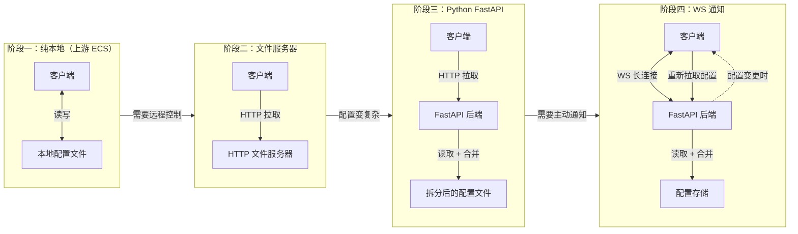
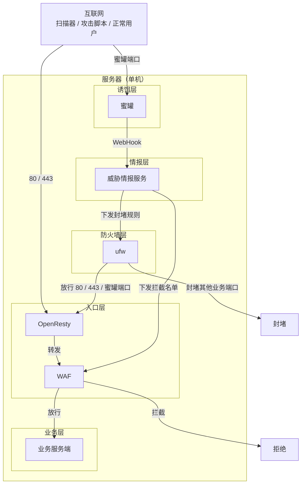
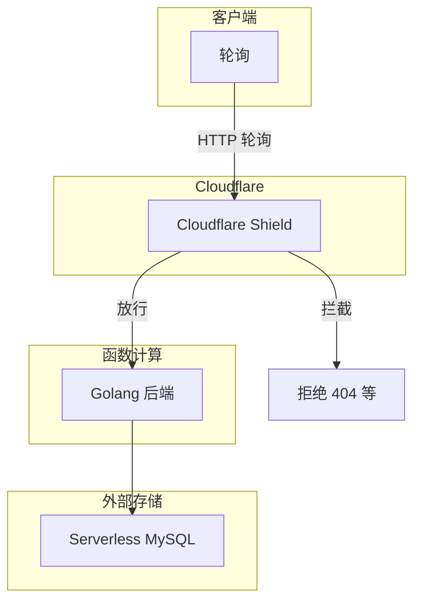
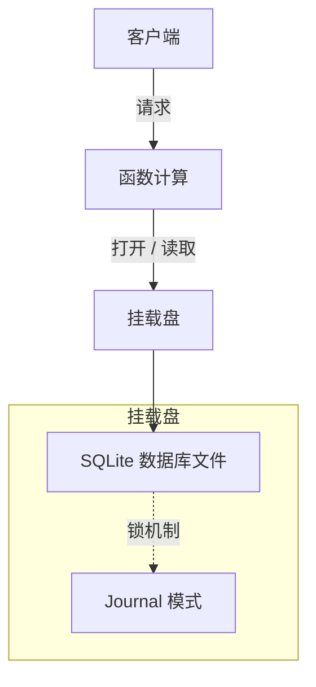
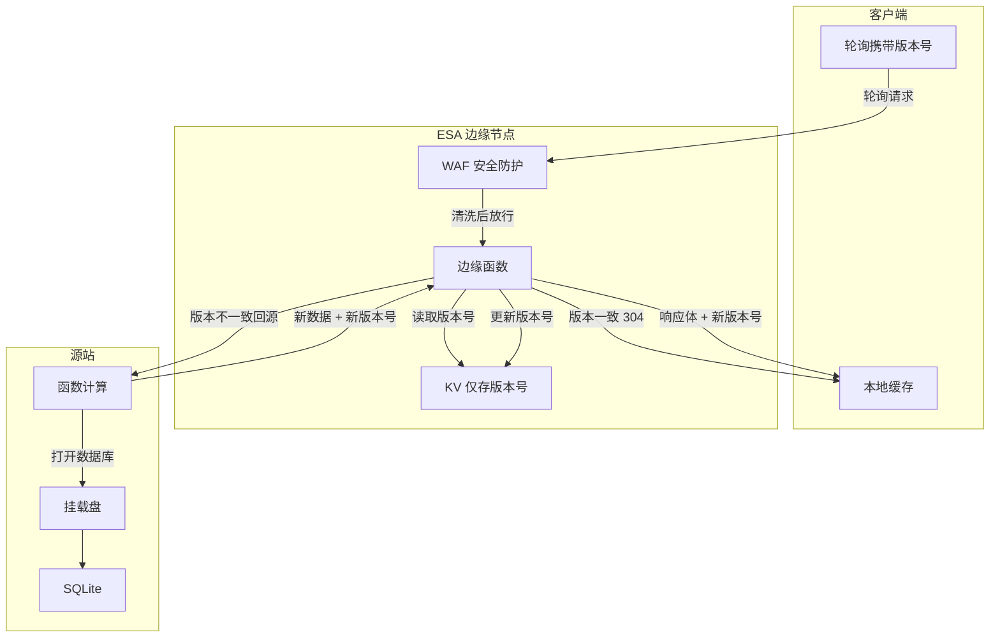
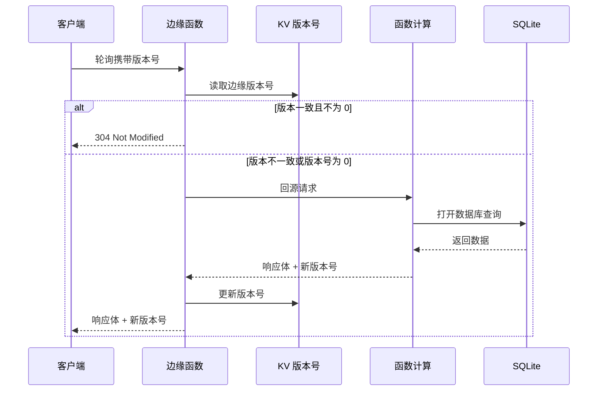
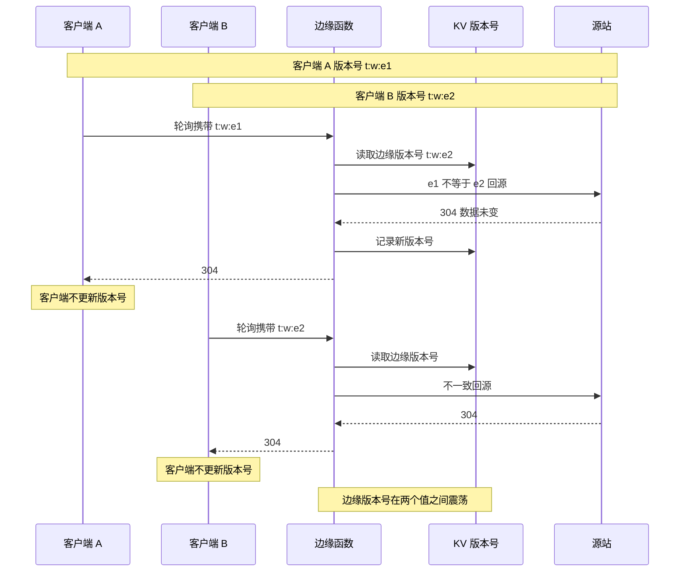

> [!TLDR]
> 要根据实际情况设计架构，**坚持实事求是，旗帜鲜明地反对 “最佳实践” 教条主义**。

很多人都喜欢抄最佳实践，这很正常，我不知道怎么做的时候我也会去抄最佳实践。做大项目的时候，最佳实践通常也是最保险的方案。但如果你长期做一个项目，就会发现最佳实践未必最佳了。**无脑照抄最佳实践，是应该被反对的**。

AstraSchedule 我已经维护了有三年，架构也已经大改了三次，每一步几乎都不是最佳实践，但组合起来反而是降本的最优解。

这篇文章**不会**教你我的最佳实践，因为**最佳实践本质上是通解**，我这个几乎都是特殊解，所以其实大部分方案你也抄不过去，但我希望的是，通过这篇文章你能学到**怎么亲自设计一个合适的架构**。

很常见的一句话说 *“没有最好的 xx，只有适合自己的 xx”*，其实放到架构设计上也一样。

这篇文章里提到的方法其实都很基础，你大概也在许多 “最佳实践” 里看过类似的，但组合起来就不太基础了。技术本身没什么好讲的，背后的方法才是更根本的东西。

## 前情提要：从本地到 C/S，一切的开端

AstraSchedule 的上游项目是这个项目：

::github{repo="EnderWolf006/ElectronClassSchedule"}

~~上游虽然早就停更了~~，但 AstraSchedule 的 Fork 也正是因为我觉得上游在架构这做得不太好。

>[!TIP] 关于上游停更
>在我写这篇文章的适合突然发现上游复活了，又开始提交新的代码了，不过由于架构冲突过大，AstraSchedule **不考虑** 合并上游新代码。

不论是上游的 ElectronClassSchedule（下文简称 ECS）还是更加成熟的 ClassIsland 都选择了纯本地的架构。ClassIsland （下文简称 CIL）虽然也支持集控但实话讲做得太简陋了，到我写这篇文章的时候官方的集控服务器还是处于 WIP 状态。

自己动手，丰衣足食。我当时就在 ECS 这个项目下 fork 了。为什么不选择更成熟的 CIL 呢？因为我当时 fork 这个项目时，我还在初中，我初中用的电脑是 Windows 7，然而 CIL 2.x 版本已经不支持 Windows 7 了。所以退而求其次选择了 ECS。

我觉得本地架构最大的问题就是我大概没什么时间在学校去配置课表，下课的十分钟那么宝贵，我用来干啥不好，补觉、上个厕所、写两道题，一个课间就过去了，何况很多学校还有个两分钟预备铃，老师再拖个堂，一个课间实际连 8 分钟可能都不到。

所以我就把他改成了 C/S 架构，这样我可以在远端修改课表，比如在家，我配置好了之后往学校把软件一装，就能用了。

这个 C/S 架构的改动是整个项目最大的改动的部分，这个是出于实际需求出发的改动，过程也比较崎岖，所以这篇文章里只做简单叙述：

从纯本地到 C/S 架构的改动其实主要就是让客户端从 HTTP 获取配置文件，早期真的就只是个文件服务器，后来变为 Python FastAPI，然后配置文件拆分，由 Python 后端负责合并。客户端使用 WS 连接服务器，然后在配置有修改时人工手动触发配置下发的命令，服务端通过 WS 提醒客户端重新拉取配置文件。



但一个问题在于把这个服务放到公网上，就免不了要接受来自全网的自动化扫描器和攻击脚本的请求，而且由于 WS 有状态的特性导致如果不依赖外部的订阅-发布机制很难做分布式，而且必然面临单点故障的隐患。

早期这套架构其实是我自用的，所以我对这些问题的解法是：

服务器部署一个蜜罐和一个 WAF，由 OpenResty 反向代理到 WAF，WAF 再反向代理到服务端。蜜罐负责收集情报，通过 WebHook 和一个单独的服务端来收集和转换这些威胁情报，然后用 ufw 封堵有实际业务的端口，只保留蜜罐端口和80, 443/tcp，而 WAF 也会从这个独立的服务端获取威胁情报加进自己的 WAF 拦截名单。

至于单点故障，反正是我自用，就这样吧。



这个架构虽然有创新，但绝大部分还是 ”最佳实践“，事实也证明绝大部分时候只是在拦空气。并没有什么实际作用。因为扫描器的请求就算发过来了打到 Python 后端上也就是 404，只是干扰日志美观性，没啥实际影响。这就是很典型的一种 **”用复杂应对简单“** 的例子，这种 ”最佳实践“ 的执行其实应该是要反对的。

实际上，由于 WAF、蜜罐本身需要较多的资源，所以服务器还是 2c4g 的，一个月不算折扣是 64 元。几乎只是徒增成本。

## Serverless 计算解决波峰波谷

后来我注意到了两个问题：我服务器也就只有这一个服务在部署了；课表数据变动并不频繁，WS 多是时候是空闲的，只有心跳包在发送。

坦率地说那个时候我还不知道函数计算是什么东西，但我又不得不面对波峰与波谷这个问题。我只是记得我在哪好像听说个这个词，好像可以按需调用，好像计费也不贵，我才去读的文档。其实我之前一直觉得这玩意儿没啥用，函数计算能做的服务器也能做，服务器能做的函数计算未必能做吧。很多时候干读文档读介绍你读不出个啥来，没有真实需求推着走，不自己动手去实践，你很难理解一项技术被发明出来到底是干嘛的。计算机科学的本质到底还是是工科。

我当时其实也想学点新东西了，所以顺势去学了 Golang，整个后端也就用 Golang 重写了。Golang 作为一个编译型语言，其好处就是部署方便，因为只有一个二进制文件。而 Python 作为解释型语言，抛开解释器环境不说，启动还得装依赖吧，本来冷启动还得耗一阵子，那也太慢了。

迁移到 Serverless 后也不得不面对几个问题：

1. Serverless 天然无状态，那么有状态的 WebSocket 何去何从？
2. Serverless 实例用完就销毁，数据存哪？数据一致性如何保证呢？
3. Serverless 后失去了 WAF 的保护，而这些大量的 404 请求真的会产生计费，怎么防？

这个时候就是展现 **特殊解** 的优势的时候了，如果按照最佳实践来：

1. 使用一个外源的 Redis 来实现订阅-发布机制
2. 使用 MySQL 等数据库来存储数据
3. 单独部署 WAF 和 API Gateway

说实话，我不相信这样成本能降下来。

不过当时我确实有一个地方没想到怎么优化，我最终是选择了：

1. 客户端改为轮询机制，以此替代 WebSocket
2. **参考最佳实践**，使用外部的 MySQL Serverless 版本进行存储
3. 使用 Cloudflare Shield 作为 API Gateway



这套方案下来确实砍了将近一半的成本。但是还是有问题的，因为 MySQL 在外部，而且 MySQL 又是 Serverless 模式，俩冷启动加起来就十多秒了。虽然 AstraSchedule 是个非时延敏感的服务，但这样意味着客户端冷启动还要再叠一层延迟，看起来就像卡了一样，一直会停在加载页面。

## SQLite 替换 Serverless MySQL

这个吧我觉得大概是整个架构设计里最令人疑惑的一点。

因为经过分析，虽然成本砍了一半，但大头是 Serverless MySQL 的成本。可问题同样在于数据读多写少，大部分时候读了和没读没啥区别。

但其实问题不大：MySQL 机器贵，但是硬盘便宜啊，挂载个云存储就好了。由于读多写少的性质，使 SQLite 在 NFS 的并发问题能够减小。其实 SQLite 的 Journal 模式是兼容 NFS 的，因为本质上都是标准的文件系统操作，最坏只是锁冲突，但是如上文所说，多读少写的性质下想要触发死锁并不太容易，而且 SQLite 的性能并不差。**实际上，触发死锁的根本原因是因为有的 NFS 还在使用有缺陷的 `fcntl()`，而在较新版本的 NFS 系统上，SQLite 的锁机制可以很可靠地工作。**

**很多文章教你开 WAL 模式其实有的时候是在误导人的**，SQLite 的 WAL 模式主要是提高并发写入的性能，对于这种多读少写的场景反而更可能产生一定程度的负优化。WAL 模式如果更好，是无论什么情况下都成立的 ”最佳实践“，其实不妨想想那为啥 SQLite 默认模式不是 WAL 模式。

在用 SQLite 替代 MySQL 之后，冷启动时间被压缩到 3s，已经到达了一个可用的级别。

最后成本被压到了 4 块钱一个月，净成本已经压到原先的 **1/16**，算上域名的固定成本平均一下也来到了原先的 1/10。



## 边缘函数 + KV 缓存

但说实话 3s 的冷启动时间还是有点难以接受的，那个时候我就有个想法，能不能存储一个数据版本号，然后客户端携带自己的数据版本号，服务端只要比对版本号是否最新就好了，最新就返回 304。我也确实去尝试做了一下，但没什么卵用。因为你还是绕不开要挂载硬盘打开数据库这个流程。

后来从 Cloudflare 转到 ESA 的时候，我看到了 ”KV 存储“ 这个功能，诶我灵机一动，我就想可以把缓存存到这啊，然后用边缘函数来应答缓存



虽然 Serverless 从理论上解决了波峰波谷的问题，但实际你会发现一个函数计算实例最短也要存活个 5 分钟，但实际上 AstraSchedule 的特性，绝大部分时候可能几秒波峰就过去了，剩下四分钟也是纯就浪费算力。诶但是注意到边缘函数是按次计费的，而且更加便宜，所以自然而然有了想要把缓存这种简单的操作搬到边缘 :spoiler[而且 CDN 不是本来就是用来缓存的嘛] ，解决 CDN 不能缓存多读少写动态资源的问题。

那么这一个大的架构更改同样牵扯到一些问题，最重要的就是：如何保证数据实时性？

解法分成两方面：一方面，KV 存储的同步本身具有一定延迟，所以提供了一个兜底方案：由用户手动在客户端点击的 ”刷新“ 操作，请求中携带的数据版本是 0，即必然回源取得最新数据。

另一方面，对于比如前一晚上配好第二天来加载客户端时，可能由于边缘 TTL 还没到期导致客户端没有及时更新。所以实际情况决定了 **这个 TTL 必须是动态的**，那怎么才能动态呢？这需要提到 AstraSchedule 的一个功能上的设计：自动任务。

> [!TIP] 题外话
> 其实我一直觉得自动任务这个名字不太好，但我想不到他还能叫啥

因为我觉得课表应该是稳定的，也没有人一学期没事就动一下课表没事就动一下课表。对于调课换课之类的属于偶发的事件，并不应该影响课表主体的数据。所以 AstraSchedule 允许数据 ”侧载“，就是通过配置规则，条件达成就自动配置课表，反之自动恢复配置，相当于允许配置临时覆盖上去。

这样就很大程度上避免了一到调课你就随心配的现象，不用动主要数据，加一个规则就好了。而规则是确定的规则，服务端当然可以通过预计算算出接下来 7 天的课表长什么样子。那么 TTL 自然可以一下子延长到 7 天。对于没有自动任务的，或者下一次触发时间特别远的，那 TTL 还可以更长。

此外，边缘还会拦截写请求，写请求执行完成后服务端会告知这次请求影响了哪些作用域，边缘会一一失效他们的缓存，即删除对应的 Key。



其实你可能会想到为什么不在边缘 KV 里顺手存完整响应呢？因为边缘的 KV 只有 1GB 的存储空间。

当然，随之变化的是，网络连通检测（访问 `/`）和 代理天气 API 也被迁移到了边缘，也就是三个最简单但是最常用的操作都被迁移到边缘了。这极大地降低了响应时间和成本（因为绝大多数时候 FC 不会被调起）。

当客户端收到了 304 的响应，直接调用本地缓存就好了。

## 踩坑合集

边缘架构是最近刚刚上线的，遇到了很多坑，在此记录并描述我的修复方法。回归到文章的本意，我希望你能从我的思路中学到如何自己设计一个优秀的架构和如何**用简单应对复杂**。

### 边缘太快了

边缘的 KV 缓存太快了，客户端刚刚启动就拿到了 304 响应，可是天气服务是代理的上游的，所以问题在于天气服务一定会比客户端 304 响应慢。而客户端的逻辑是拿到核心数据就先显示，其他没拿到的数据先占位。所以架构正式上线的第一个版本中会显示当前气温 `000℃` ，这个本意是提示天气服务可能异常或者还没准备好，但看起来就像什么 Bug 一样，很奇怪。


> [!SUCCESS] 解法
> 让占位符为空字符串就好了。


这就是 **用简单应对复杂**。可能从表面问题出发，你会想如何让天气响应也快一点，比如也缓存一下；或者要不要调整客户端的启动流程顺序一类。其实根本不要，工程里面有很多 ”掩耳盗铃“ 的操作，说实话很多问题不是问题，比如这个，本质上是用户体验的问题，那只要让用户没觉得有问题就好了。

### 缓存震荡

> [!TIP] 有关 ”缓存震荡“
> 其实缓存震荡不是一个标准术语，是我胡诌出来的一个词。也许你听完觉得我接下来描述的这个问题更像 ”缓存击穿“，但我觉得用 ”震荡“ 这个比喻更好一些

这个问题是改代码实现时的一个疏忽。一个完整的数据版本号串由以下几个值组成：

```text
<数据最后一次变更时间戳>:<当前教学周数>:<预测下一次更新时间>
简化表述为：<t>:<w>:<e>
```

由于 `t` 只要没有数据更新就一样，但是 `e` 却有一个固定的最短的 7 天滚动窗口。所以不同天生成出的版本号串，`t` 和 `w` 通常是一样的，但是 `e` 不一样。边缘对比的是完整的版本号串，导致如果有两个客户端挂了同一个班级，又在不同天点了刷新数据，两个客户端就会各存储一个版本号。

这两个版本号只有结尾不一样，打到边缘边缘判断发现其中一个看起来不是最新版本，就会把那一个打回源站，而源站的判定比边缘宽松，最终还是会返回 304。而源站返回 304，边缘会记录一个新的版本号，但是客户端收到 304 却是没有任何操作，下一次还是会带着这个版本号再问一遍。

这样边缘只会告诉其中一个客户端他的版本号是最新的，但两个客户端其实都是最新的，而且其中一个要打回源站浪费资源；边缘记录的缓存也在两个版本号中来回震荡。



> [!SUCCESS] 解法
> 分成两个部分：
> 
>  - 过去：在边缘设置 ”门禁“，通过 UA 判定客户端版本，如果低于指定版本就返回 426 拒绝
>  - 未来：把边缘的判定算法和源站改得一致，判定时忽略 `e` 这个字段

### 回源流量异常

由于正常流量都在边缘被处理了，而异常的扫描器/攻击流量反而浮了出来。

其实是因为 ESA 没有 API Gateway 功能，所以很大一部分流量本来在 Cloudflare 那会被拦，到 ESA 这就漏过去了。

> [!TIP] 关于 ESA 的 API 防护
> 其实是有的，但是基础版套餐只让设置 10 个 API 接口，根本不够用。
> 
> :spoiler[Cloudflare 免费计划允许设置 100 个接口]

这个部分将其来就复杂了，接下来会单开一节讲在没有 API Gateway 的情况下曲线救国保证 API 安全。

## 曲线救国的安全

总体思路很简单啊，根据攻击请求的特征配规则就好了。

> [!TIP] 关于下文的叙述
> 其实叙述的顺序并不是我实际配规则的顺序，因为来回改了太多次，完整按时间顺序写那车轱辘话也太多了。为了方便理解，规则的部分细节被省略。

### 1. 非中国地区必须经过 JS 挑战

这是一个大部分国内网站都会配的规则，因为通常你也没啥外国客户，自然你可以选择屏蔽掉他们。像我觉得保险一些，就弄个 JS 挑战吧，万一是真人呢？

> [!DANGER] 异常；
> 一堆港澳台的恶意 IP 被暴露出来

~~选择物化政导致的，肌肉记忆坚持一个中国原则了~~。呃其实确实怪我规则没配好，在阿里云 ESA WAF 里中国大陆，和港澳台三个地区确实是分开的，我顺手把港澳台三个选项也勾上了而已。

### 2. 非标准来源请求 JS 挑战

~~万一港澳台真有人用呢~~。我想到，其实可以通过请求头来识别是否来自合法的客户端嘛，因为扫描器通常不会伪造请求头，最多伪造个 UA。然后我发现浏览器基本都有限制，JS 层面修改 UA 是不被允许的，并不会生效。

好吧，那自定义头呢？很可惜也不行，阿里云 ESA WAF 只有高级版及以上套餐才提供这个判定条件。

然后我在他可选的判定条件里翻啊翻，诶，我可以用 Referer 头啊。

实际上这又有一个架构设计导致的巧合：由于前后端分离，前后端绑定在不同的域名上，所以前端发出请求的 Referer 必然来自前端所绑定的域名。由于全网的自动化扫描器通常不具有针对性，所以一半不会伪造 Referer，要伪造也只会伪造当前域名的 Referer，然而恰恰前后端域名不一样，所以一方面 Referer 不可能是后端自己，后端接收到的 Referer 也应该一定来自几个可以被枚举的合法前端域名。

好，理论成立，所以就配置了：**如果 Referer 不来自预期的域名，且 UA 不是客户端的 UA**，就 *发起 JS 挑战*

> [!DANGER] 异常；
> 阿里云 ESA WAF 显示 CSR 高达 **98%**，即所有拦截请求中有 98% 的请求通过了 JS 挑战。

~~阿里云你到底挑战谁了啊~~，这个数据意味着，其实已经有很多自动化的扫描器能自动绕过 WAF 的 JS 挑战了。

### 3. 大陆外非标来源拦截，大陆内非标来源挑战

那就再加一个地理条件吧。

**如果请求来自中国大陆（不含港澳台）外，且没有携带预期的 UA 或者 Referer**，那么 *拦截*

**如果请求来自中国大陆内，但没有携带预期的 UA 或者 Referer**，那么 *发起 JS 挑战*

> [!TIP] 为什么要给国内开个口子？
> 因为我要开发调试。

其实到这里你看，完全就是一个白名单的机制。**当你能明确描述一个好人应该是什么样的时候，你就没必要枚举坏人长啥样**。很多人配 WAF 的时候不敢按白名单的逻辑配，但是黑名单 **必然存在滞后性**，只有当攻击发生了你才能汲取教训，知道新型攻击长啥样。但是白名单不一样，新型攻击只要不是针对性攻击，他就不可能和正常请求特征一样，而且正常请求的特征是可以被描述的，那就可以被固定的规则辨别。

> [!DANGER] 异常；
> 搜索引擎也被拦了

### 4. 用一个很短的规则过滤出搜索引擎

搜索引擎被拦截了其实不意外，因为搜索引擎确实符合那些特征：IP 境外，Referer 为空，UA 不符合预期。

所以需要一个单独的白名单规则来放开搜索引擎。可是枚举所有搜索引擎的 UA 也太困难了，阿里云 ESA WAF 的白名单规则还限制长度，判定合法爬虫需要专业版以上才支持。怎么办呢？**这段开头就告诉你了**：*根据攻击请求的特征配规则就好了*。

不难发现，扫描器为了伪装自己，一般热衷于把自己的 UA 伪装成浏览器，而搜索引擎不一样，他们是合法爬虫，他们不需要伪装，他们会光明正大告诉你他们是 Bot 或者 Spider，但扫描器不敢。所以你就可以反其道而行之：**如果请求 UA 里包含 Bot、Spider 或者 Search 字样，则跳过部分防护**。

值得注意的是，我这里的表述为跳过 **部分** 防护。会跳过什么呢？智能限频，BOT 管理，安全级别，挑战类规则。**拦截类规则不会被跳过**，因为你可能也已经想到，Censys 一类网络空间测绘服务本来也会光明正大告诉你他们是扫描器，所以你可以在拦截类规则中单独枚举他们来拦截，这样例外一下就缩小很多。对于 [[#3. 大陆外非标来源拦截，大陆内非标来源挑战|上一段]] 中的拦截规则，也是不跳过的。因为上一段保护的是后端服务，搜索引擎本来不可能也不应该爬取后端接口。

## 什么是 ”最佳实践“？

最佳实践，本质上来说就是一个通解，和你在学生时代抄的参考答案一样，本质上说只是具有参考意义，但你抄上去肯定不会错。比参考答案优秀的答案不在少数，比最佳实践优秀的架构设计更不在少数。

解数学题，老师一般都会教一个特殊解，然后再跟一个通解。通解可以适用于一类题，但是未必是本题的最优解法。~~你总不可能单靠一个求根公式混了初高中六年吧~~

- Serverless MySQL：托管数据库是“最佳实践”，但读多写少 + 冷启动敏感让它不成立
- WebSocket：实时同步是“最佳实践”，但 Serverless 无状态，WS 失效，轮询反而更实际
- 响应体缓存：在缓存层是“最佳实践”，但 KV 只有 1GB，版本号协商才是解
- SQLite：生产环境用托管数据库是“最佳实践”，但成本敏感 + 单实例够用，SQLite 才是最优解
- 各种安全设备：WAF + 蜜罐 + 分布式是 “最佳实践”，但个人项目没有敌人，设备在防空气

其实整个文章到这，回去再想想，我说得噱头一点，我完全可以说我做了 *“全链路优化”* 了。

但如果一开始我就说 “我要做全链路优化”，我大概会做出完全不同的选择：

我还是会用函数计算，但理由从“省成本”变成“高并发”；

我会把函数拆成微服务，因为“最佳实践”说这样更解耦；

我会跳过 MySQL 直接用 PostgreSQL，因为“最佳实践”说它更强大；

我会加 Redis 缓存，因为“最佳实践”说缓存要用 Redis；

我会坚持 WebSocket，因为“最佳实践”说轮询是低级方案。

**架构更“高级”，成本更高，复杂度更大，用户体验未必更好。**

## 这篇文章不是最佳实践

这篇文章虽然反对 “最佳实践”，但我同样希望你真的从里面学出来了一些方法来。但有些局部方案确实可以抄

比如 [[#4. 用一个很短的规则过滤出搜索引擎|前文]] 里提出的用一个简单规则判断合法 Bot 的方法，他的约束可复现（ESA 基础版和免费版不具备识别合法爬虫的能力，且扫描器热衷于伪装浏览器）。但是架构不能抄，因为约束太多、太具体了。

总而言之，文章里如果有些局部方案和你的情况一模一样，那也可以抄一抄，但大的架构是没法复制的，因为约束太多了。

**本文并不反对借鉴最佳实践，但反对不思考约束就照搬。**

工程领域里有个很简单的道理：用最简单的结构解决最复杂的问题，远比用复杂应对复杂更好。

这套架构最大的缺点是没法抄作业，最大的优点是没法抄作业。

**好的架构是“榨干”了简单组件的潜力，而不是“堆砌”了复杂组件的功能。**

所以这篇文章不是最佳实践，它只是一份思路的参考。它反对教条主义，所以它自己也不该成为新的教条。

**你该带走的不是这套架构，而是这套方法：回到你的实际约束，设计自己的局部最优。**

每一个决定，都不是因为某个技术 “更先进”。没有哪个选择是 “因为大家都说好”，每个选择都是 “因为我的情况需要”。说白了就是四个字：**实事求是**。一切从实际出发，不唯上、不唯书、不唯新，只唯实。反过来说，就是要 **反对教条主义**。很多 “最佳实践” 是有边界条件的，甚至很多实践都没说自己是最佳实践，就被拿过来生搬硬套。

每一步都是那时的局部最优解。局部最优不一定等于全局最优，但工程架构里，局部最优近似于、甚至优先于全局最优。因为全局最优不可计算，而局部最优是真实的、可执行的、可验证的。工程里的全局最优，本来就是局部最优串起来的那条路。

## 杂感

相信读完上文你已经能够知道为什么开放公益性质的 SaaS 了。我在 [[#SQLite 替换 Serverless MySQL]] 之后就着手做了他的 SaaS 版本，因为到这个时候，我清楚地知道，这个玩意儿从运行角度说已经不值钱了。

这么大一堆改动之后，用现在流行的话讲叫达到了新的 “帕累托前沿”，但用户其实无感，最多觉得启动快了一点，因为本来就是免费的，他没啥价格上的直接感受。[[#边缘函数 + KV 缓存]] 则更多只是锦上添花了。

这么一大堆东西，最后连带 SaaS 端的代码也是完整以 AGPL 开源的，这篇文章也以 CC BY-NC-SA 4.0 发布。其实因为我也不想遮掩什么，技术这玩意儿最终是为了造福人类的，何必藏着掖着呢？

在我博客的 [[给定节假日安排怎么自动算出调休规则|另一篇文章]] 中也完整介绍了 AstraSchedule 的一个特色功能中所使用的一个创新算法，同样是以 CC BY-NC-SA 4.0 公开的。

我忍不住想聊一聊我个人的愿景：构建一种基础设施型科技。我觉得现在很多科技的方向都偏了，噱头太多了，“科技向善”、“以人为本” 似乎也越来越少被提起了。我觉得应该没人累了一天回家想要看一个机器人扭秧歌。科技应该像一个基础设施一样，或者说形象点，像一个水龙头一样，他就在那，但他平时对你没有任何影响，你平时也记不得他，但你想用的时候他总是在那；或者像路由器一样，他一直开着，但你平时更不会想起他来，除非他坏了。**科技应该是稳定的，可靠的，真正融入到人类生活中的。**

**制造一项令人惊叹的技术并不难，制造一项令人依赖的技术才最难。**

